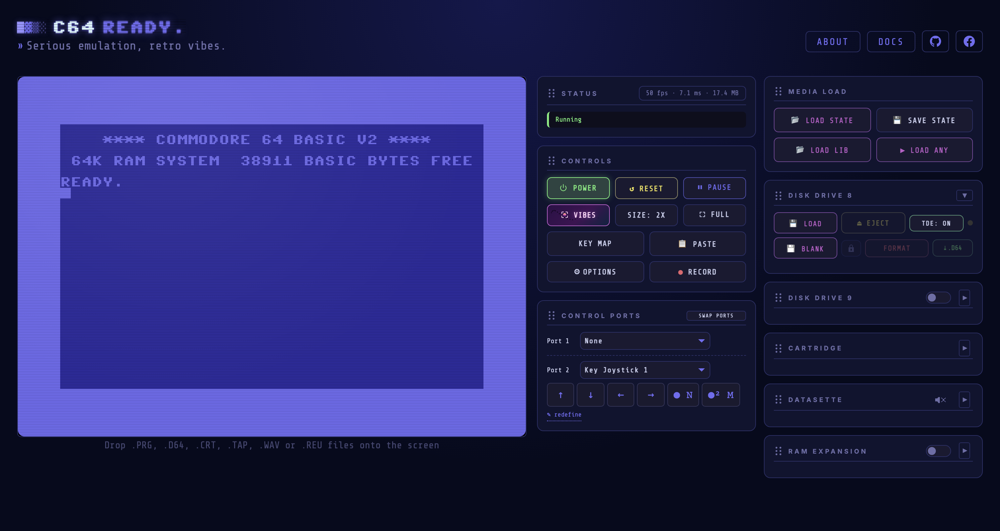
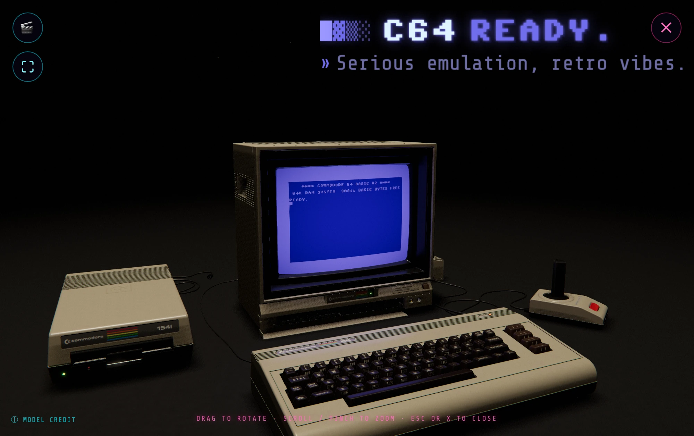

```
██████████████████████████████████████████████████████████████████████████████████████████████
█▓▓▓▓▓▓▓▓▓▓▓▓▓▓▓▓▓▓▓▓▓▓▓▓▓▓▓▓▓▓▓▓▓▓▓▓▓▓▓▓▓▓▓▓▓▓▓▓▓▓▓▓▓▓▓▓▓▓▓▓▓▓▓▓▓▓▓▓▓▓▓▓▓▓▓▓▓▓▓▓▓▓▓▓▓▓▓▓▓▓▓▓█
█▓▒▒▒▒▒▒▒▒▒▒▒▒▒▒▒▒▒▒▒▒▒▒▒▒▒▒▒▒▒▒▒▒▒▒▒▒▒▒▒▒▒▒▒▒▒▒▒▒▒▒▒▒▒▒▒▒▒▒▒▒▒▒▒▒▒▒▒▒▒▒▒▒▒▒▒▒▒▒▒▒▒▒▒▒▒▒▒▒▒▒▓█
█▓▒░░░░░░░░░░░░░░░░░░░░░░░░░░░░░░░░░░░░░░░░░░░░░░░░░░░░░░░░░░░░░░░░░░░░░░░░░░░░░░░░░░░░░░░░▒▓█
█▓▒░                                                                                      ░▒▓█
█▓▒░ ████████  ████████  ██    ██     ██████    ████████    ████    ██████    ██    ██    ░▒▓█
█▓▒░ ██        ██        ██    ██     ██    ██  ██        ██    ██  ██    ██  ██    ██    ░▒▓█
█▓▒░ ██        ████████  ████████     ██████    ██████    ████████  ██    ██    ████      ░▒▓█
█▓▒░ ██        ██    ██        ██     ██  ██    ██        ██    ██  ██    ██    ████      ░▒▓█
█▓▒░ ████████  ████████        ██     ██    ██  ████████  ██    ██  ██████      ████   ██ ░▒▓█
█▓▒░                                                                                      ░▒▓█
█▓▒░                     ░▒▓█  Serious emulation,  retro vibes.  █▓▒░                     ░▒▓█
█▓▒░                                                                                      ░▒▓█
█▓▒░ READY.                                                                               ░▒▓█
█▓▒░ █                                                                                    ░▒▓█
█▓▒░                                                                                      ░▒▓█
█▓▒░░░░░░░░░░░░░░░░░░░░░░░░░░░░░░░░░░░░░░░░░░░░░░░░░░░░░░░░░░░░░░░░░░░░░░░░░░░░░░░░░░░░░░░░▒▓█
█▓▒▒▒▒▒▒▒▒▒▒▒▒▒▒▒▒▒▒▒▒▒▒▒▒▒▒▒▒▒▒▒▒▒▒▒▒▒▒▒▒▒▒▒▒▒▒▒▒▒▒▒▒▒▒▒▒▒▒▒▒▒▒▒▒▒▒▒▒▒▒▒▒▒▒▒▒▒▒▒▒▒▒▒▒▒▒▒▒▒▒▓█
█▓▓▓▓▓▓▓▓▓▓▓▓▓▓▓▓▓▓▓▓▓▓▓▓▓▓▓▓▓▓▓▓▓▓▓▓▓▓▓▓▓▓▓▓▓▓▓▓▓▓▓▓▓▓▓▓▓▓▓▓▓▓▓▓▓▓▓▓▓▓▓▓▓▓▓▓▓▓▓▓▓▓▓▓▓▓▓▓▓▓▓▓█
██████████████████████████████████████████████████████████████████████████████████████████████
```

> A cycle-exact Commodore 64, emulated from the silicon up and running entirely in your browser. No plugins, no installs.

## What it is

A Commodore 64 rebuilt from scratch in modern JavaScript: the 6510 CPU with every
illegal opcode, raster-level VIC-II, both SID chips (6581 & 8580), CIA timers, and a
true 1541 drive that runs the nastiest custom fastloaders. Drop in a `.d64`, `.prg`,
`.tap`, `.wav`, `.crt`, or `.reu` and go. It installs as an app and runs offline, on desktop or phone.

What makes it different: it is not a VICE source port. Every chip is written from scratch
and then held to real hardware, using VICE as a differential oracle alongside the Lorenz
and Klaus Dormann test suites, C64 hardware test programs, and real games and demos. The
result is checked by 2,400+ tests that live in this repository.

**▶ Play it live at [c64ready.com](https://www.c64ready.com)**





## Features

- **Cycle-exact** 6510 CPU (full illegal-opcode set), raster-level VIC-II, and both SID revisions (6581 & 8580) on a reSID engine compiled to WebAssembly
- **True 1541 drive**: real `.d64` images (35-, 40- and 42-track, error tables honoured), custom fastloaders, and disk writing: `SAVE`, format and scratch through the real DOS
- Loads `.prg`, `.d64`, `.tap`, `.wav`, `.crt` (generic, Action Replay, Final Cartridge III, Magic Desk, EasyFlash), and `.reu`
- **RAM Expansion Unit**: fit a 1700, 1764, 1750, 1750 XL or a generic unit up to 16 MB, fill it from a `.reu` image and save it back out
- **Datasette** that reads *and* writes: `SAVE` to tape, turbo savers included, and tapes move in and out as `.wav` cassette audio
- Joystick / gamepad, 1351 & NEOS mouse, Paddle, Touch joystick, and two Key Joysticks across the control ports
- Full-machine save / load state, video recording, Retro Vibes 3D scenes (with WebXR VR)
- Cosmetic CRT display modes, installable & offline (PWA)

→ [Full feature list](docs/FEATURES.md)

## Getting started

The easiest way in is the [live version](https://www.c64ready.com). To run it locally you
need **Node.js 20.19+ or 22.12+** (22 LTS or newer recommended) and your own C64 ROMs in
`roms/` (see below), then:

```bash
npm install
npm run dev      # dev server
npm test         # the full test suite
npm run build    # production build
```

`npm test` runs everything in Node, no browser needed: unit tests, timing spec tests and
the C64 hardware test programs the emulator is measured against. It reads the same ROMs
from `roms/` and stops early if they are missing; without `roms/1541.bin` the true-drive
tests are skipped and the rest still run.

→ [Getting started](docs/GETTING-STARTED.md) · [User guide](docs/USER-GUIDE.md) · [Testing & debugging](docs/TESTING.md)

### Why the ROMs are not included

The Commodore KERNAL, BASIC and character ROMs are still under copyright, so they cannot
be redistributed here. Supply your own `kernal.bin`, `basic.bin` and `chargen.bin`, plus
`1541.bin` for the true drive: put them in `roms/`, or add them once in the emulator UI,
where the browser keeps them for next time.

### The 3D models are a manual download

Retro Vibes, the 3D viewer, loads `commodore_64.glb` (18 MB) or the 4K-texture
`commodore_64_4k.glb` (95 MB). At 113 MB together they are not in the repository, and
nothing else needs them — a missing model just shows `COULD NOT LOAD MODEL` in the viewer.

Get it from the source, *"Commodore 64 || Computer (Full Pack)"* by dark_igorek, [CC BY
4.0](https://creativecommons.org/licenses/by/4.0/): **<https://skfb.ly/oUKFx>**

Save the `.glb` at the top level of `public/`, named to match — the viewer asks for it at
the site root, so a subfolder will not do:

```text
public/commodore_64.glb        # the default
public/commodore_64_4k.glb     # optional 4K export
```

The light one is enough; 4K is only used when **Options ▸ Display ▸ 3D MODEL SIZE** is
LARGE, or AUTO on a desktop. Both are git-ignored, and `npm run build` copies `public/`
into `dist/`, so whichever you add ships with the build.

## Documentation

Hosted at **[c64ready.com/docs](https://www.c64ready.com/docs/)**; sources in [`docs/`](docs/).

- [Architecture](docs/ARCHITECTURE.md) · [Component status](docs/COMPONENT-STATUS.md) · [Known issues](docs/KNOWN-ISSUES.md)
- Deep dives: [Machine](docs/MACHINE-ARCHITECTURE.md) · [CPU](docs/CPU-ARCHITECTURE.md) · [VIC-II](docs/VIC2-ARCHITECTURE.md) · [SID](docs/SID-ARCHITECTURE.md) · [Memory](docs/MEMORY-ARCHITECTURE.md) · [Drive](docs/DRIVE-ARCHITECTURE.md) · [Datasette](docs/DATASETTE-ARCHITECTURE.md)
- [Retro Vibes](docs/RETROVIBES-ARCHITECTURE.md) · [Performance](docs/PERFORMANCE-ANALYSIS.md) · [Testing & debugging](docs/TESTING.md) · [Specifications & sources](docs/SPECIFICATIONS.md)

## Project structure

```
.
├── src/              # the emulator, one module per chip / subsystem
│   ├── machine.js    # wires the machine together on a PAL master clock
│   ├── cpu.js        # 6510 CPU (official + illegal opcodes)
│   ├── vic2.js       # VIC-II video, raster-level (+ vic2-tables/line/sprites/render.js)
│   ├── sid-voice.js  # SID audio DSP (+ sid-worklet.js)
│   ├── cia.js        # CIA timers & I/O
│   ├── memory.js     # RAM / ROM / PLA banking
│   ├── drive1541.js  # true 1541 drive (+ d64.js, gcr.js)
│   ├── reu.js        # RAM Expansion Unit, the 8726 REC as a second bus master
│   └── …             # datasette, control ports, CRT, input, UI, Retro Vibes
├── rust/             # reSID engine in Rust, compiled to the WebAssembly SID
├── docs/             # Markdown docs, compiled to HTML by tools/build-docs.mjs
├── test/             # unit + spec + hardware-testprog suites (npm test)
├── public/           # static assets: fonts, icons, 3D models, screenshots, compiled docs
├── tools/            # build + dev tooling: docs compile, screenshot & perf harnesses
├── index.html        # app entry point
├── vite.config.js    # dev server + production build
├── LICENSE           # GPL-3.0-or-later
└── NOTICE.txt        # third-party attributions
```

## Reporting a problem

Bug reports and pull requests are welcome. Check [Known issues](docs/KNOWN-ISSUES.md)
first, then open an issue on
[GitHub](https://github.com/mortyeriksen/c64ready/issues) with what you loaded (and where
it came from, if it is freely available), what you expected, what happened instead, and
your browser and OS. A screenshot or short recording helps a lot.

→ [Contributing](CONTRIBUTING.md)

## How it was built

C64 READY. was developed with extensive generative-AI assistance. The maintainer directs
the architecture, verification, releases and maintenance. Correctness is evaluated through
reproducible tests, differential comparison with VICE and real C64 software.

## Acknowledgements

C64 READY. stands on decades of C64 reverse-engineering and the demoscene. Full credits
(hardware references, tools, groups, fonts, and the 3D model) are in the in-app **About**
dialog and in [Specifications & sources](docs/SPECIFICATIONS.md).

## Privacy

Everything runs in your browser. ROMs, disks, tapes, cartridges and save states are kept in
the browser's own storage (localStorage / IndexedDB) and are never uploaded. The site sets no
cookies and loads no third-party scripts. The only telemetry is a few empty marker pages the
app requests (`/pwa.html`, `/pwa-installed.html`, `/roms-loaded.html`, `/roms-vice.html`; see
`src/main.js`) so the host's server-side statistics (Netlify Analytics) can count how many
sessions run installed or with ROMs. They carry no payload and no identifier.

## License

Copyright © 2026 Morten Øien Eriksen.

Licensed under **GPL-3.0-or-later**, see [`LICENSE`](./LICENSE). Bundled third-party
materials (the fonts, the 3D model, three.js and Workbox) remain under their own licenses;
they and the reSID lineage of the SID engine are attributed in [`NOTICE.txt`](NOTICE.txt).
The Commodore / MOS ROMs are copyrighted by their rights holders and are **not** included.
Supply your own.
